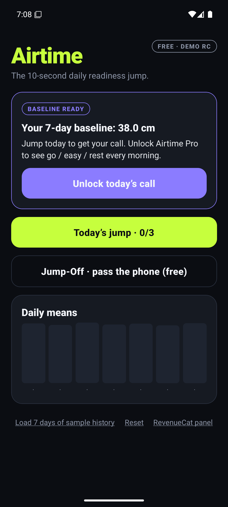
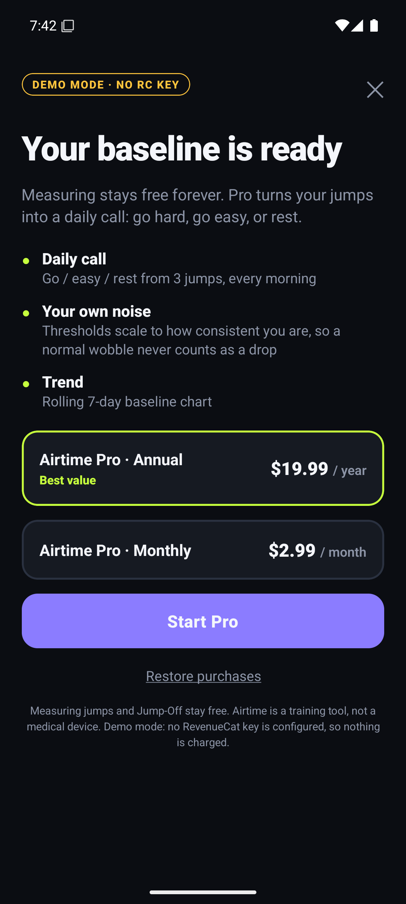
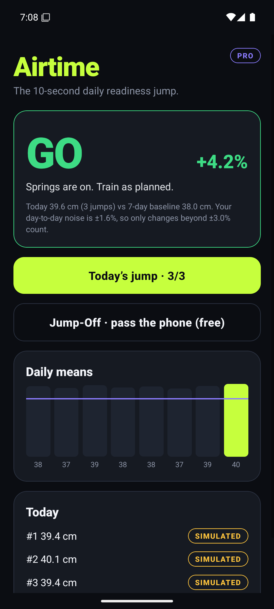
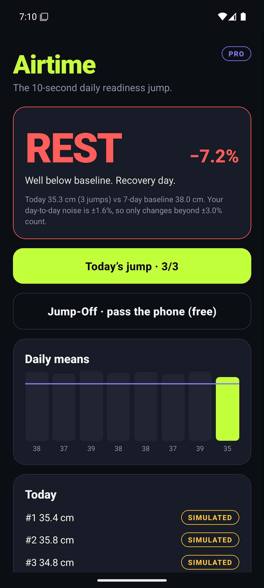
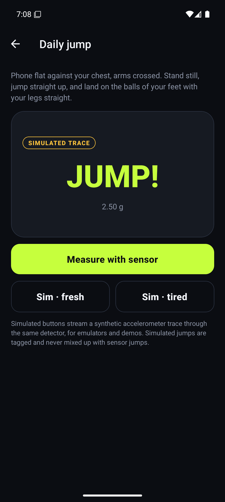
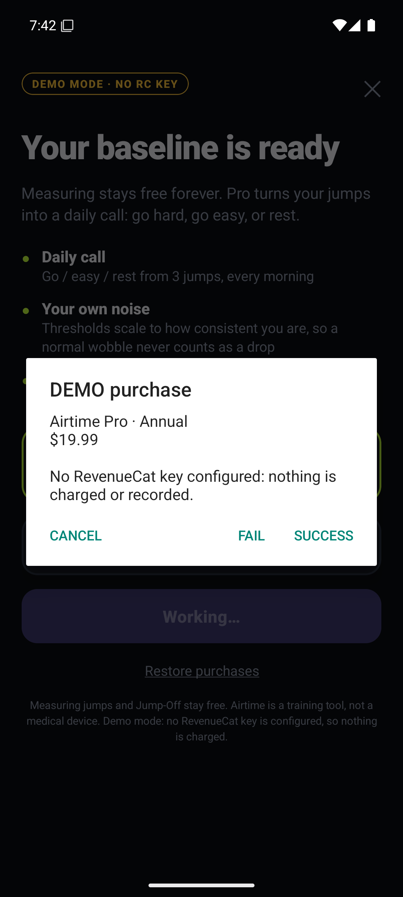
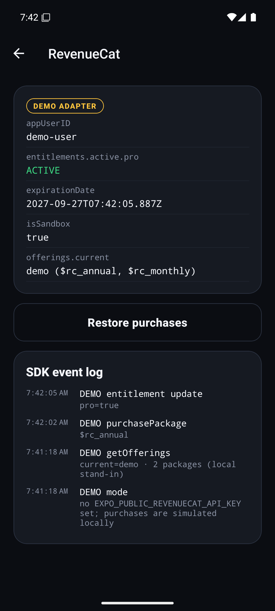
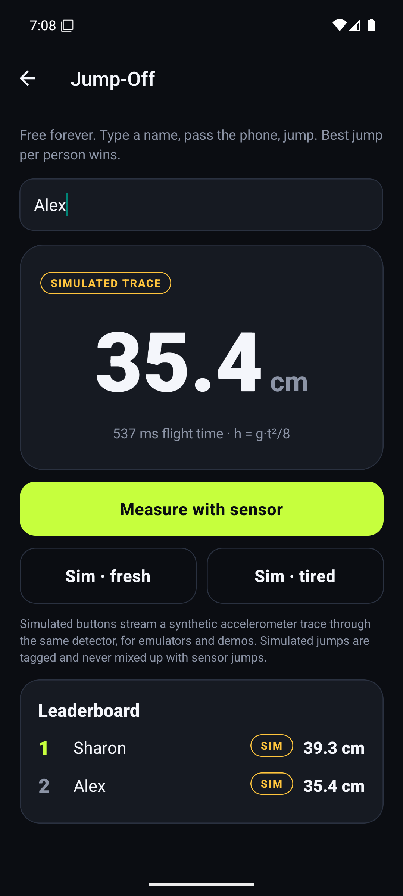

# Airtime: the 10-second daily readiness jump

Three jumps with your phone held to your chest. Airtime times each flight with the accelerometer, compares today against **your own** rolling baseline, and gives you a call: **GO**, **EASY** or **REST**.

- **Free:** single jumps, plus **Jump-Off**, a pass-the-phone party leaderboard.
- **Airtime Pro (RevenueCat):** the daily readiness call, noise-aware thresholds and the baseline trend. The paywall appears when your 3-day baseline is ready, not before.

Built for RevenueCat Shipaton 2026 (Next Gen / student category).

## How it works

| Step | Code |
| --- | --- |
| Accelerometer at 100 Hz (`expo-sensors`), magnitude in g | `src/hooks/useJumpSensor.ts` |
| Streaming, orientation-independent detector: stillness → push-off → sustained free fall → landing, with symmetric interpolated edges; rejects dropped phones, sensor gaps, phone sliding mid-air, tiny hops and non-still starts | `src/core/detector.ts` |
| Height from flight time `h = g·t²/8` | `src/core/physics.ts` |
| Readiness: first 3 jumps/day, baseline = mean of the previous 3–7 days, threshold = max(3 %, your day-to-day CV); `go` > −thr ≥ `easy` > −2·thr ≥ `rest` | `src/core/readiness.ts` |
| Jump-Off leaderboard (best per person, shared ranks) | `src/core/jumpoff.ts` |
| RevenueCat adapter (configure, offerings, purchase, CustomerInfo listener, restore) | `src/purchases/` |

**Emulator-safe fallback.** Emulators (and judges without a phone) can press **Sim · fresh** / **Sim · tired**. These stream a synthetic accelerometer trace (`src/core/synth.ts`) in real time through the *same* detector. Simulated jumps are tagged `SIMULATED` wherever they appear. "Load 7 days of sample history" seeds labelled `sample-data`, so the readiness flow can be shown on day one.

**Honesty.** Handheld flight-time estimates carry real absolute error, and the published smartphone method (My Jump / My Jump Lab, video-based) exists and deserves credit. Airtime does not claim lab accuracy. It shows centimetres as an estimate and makes decisions on *relative change beyond your own noise*. See [docs/validation.md](docs/validation.md).

## RevenueCat

- SDK: `react-native-purchases` 10.10.0 (Test Store needs ≥ 9.5.4).
- Entitlement: `pro`. Offering: `default`, with `$rc_annual` and `$rc_monthly` packages. Optional Offering metadata `headline` / `subhead` drives the paywall copy remotely.
- The key is read from `EXPO_PUBLIC_REVENUECAT_API_KEY` at build time. Leave it unset and the app runs a clearly labelled **DEMO adapter** (success / fail / cancel sheet, nothing charged). Never commit keys, and never ship a Test Store key to a store.
- **RevenueCat panel** (tap the FREE/PRO badge): live `appUserID`, `entitlements.active.pro`, expiration, sandbox flag, current offering and an SDK event log, for on-camera proof.

Dashboard setup: [docs/monetization.md](docs/monetization.md).

## Run

```bash
npm install
npm test            # 32 unit tests for the physics, detector, readiness and Jump-Off code
npm run lint && npm run typecheck
# development build (native modules, so Expo Go is not enough)
EXPO_PUBLIC_REVENUECAT_API_KEY=test_xxx npx expo run:android
# or a standalone release APK
npx expo prebuild -p android && (cd android && ./gradlew assembleRelease)
```

## Docs

- [docs/validation.md](docs/validation.md): method, error sources, validation protocol
- [docs/monetization.md](docs/monetization.md): RevenueCat setup and pricing rationale
- [docs/devpost.md](docs/devpost.md): submission copy, demo script, eligibility checklist
- [docs/MERGE.md](docs/MERGE.md): merging into the parallel Airtime repo

MIT licensed.

## Reproducible demo
`scripts/demo-android.sh` drives a running emulator through the whole golden path using simulated traces and the demo purchase adapter, and regenerates every screenshot below. App icons are generated by `scripts/make_icons.py`. The student-category checklist is in [docs/eligibility.md](docs/eligibility.md).

## Screenshots (Android emulator, release APK, demo RevenueCat adapter, simulated jumps)
| | | | |
| --- | --- | --- | --- |
|  |  |  |  |
|  |  |  |  |

## Verification status
- Verified locally: 32/32 unit tests, `expo lint`, `tsc --noEmit`, `expo-doctor` (21/21), a release APK built and run on an Android 15 emulator, and the full golden path (simulated jumps → paywall at baseline → demo purchase → Pro call → RevenueCat panel → Jump-Off).
- Verified 2026-09-27: a genuine RevenueCat **Test Store** purchase on a debuggable Android build — `entitlements.active.pro` = ACTIVE, `isSandbox` = true. Evidence and repro in [docs/monetization.md](docs/monetization.md) (`docs/screenshots/11-*-teststore.png`).
- Not yet verified: real-phone sensor jumps.
